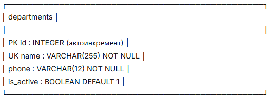

# Вариант №5
# Сервис управления отделениями СПО (Department Service)

## Область применения
Сервис работает **только с отделениями СПО** (Среднего Профессионального Образования).
Факультеты не входят в область ответственности данного сервиса.

## Сущность: Department (Отделение СПО)

### Описание полей сущности

| Поле | Тип | Описание |
|------|-----|-----------|
| `id` | int | Уникальный идентификатор (первичный ключ) |
| `name` | str | Название отделения. Уникально. Длина от 3 до 255 символов. |
| `phone` | str | Телефон отделения. Формат: +7XXXXXXXXXX (ровно 12 символов). Не уникален. |
| `is_active` | bool | Активно ли отделение. По умолчанию True. **Не передаётся при создании** |

### 1. Информация для создания сущности

| Параметр | Обязательность | Тип | Ограничение | Значение по умолчанию | Описание |
|----------|----------------|-----|-------------|----------------------|-----------|
| `name` | Да | str | длина от 3 до 255 символов, уникально | — | Название отделения СПО |
| `phone` | Да | str | формат `+7XXXXXXXXXX` (12 символов) | — | Телефон отделения |

**Уникальные поля:**  
- `name` — уникальное значение (не может быть двух отделений СПО с одинаковым названием)

### 2. Информация, возвращаемая при успешном создании

| Параметр | Тип | Описание |
|----------|-----|-----------|
| `id` | int | Уникальный идентификатор |
| `name` | str | Название отделения |
| `phone` | str | Телефон отделения |
| `is_active` | bool | Активно ли отделение (всегда `True` при создании) |

## Изменить сущность по ID

### 3. Информация для изменения сущности

| Параметр | Обязательность | Тип | Ограничение | Значение по умолчанию | Описание |
|----------|----------------|-----|-------------|----------------------|-----------|
| `name` | Нет | str | длина от 3 до 255 символов, уникально (кроме самого себя) | текущее значение | Новое название отделения |
| `phone` | Нет | str | формат `+7XXXXXXXXXX` (12 символов) | текущее значение | Новый телефон отделения |
| `is_active` | Нет | bool | `True` или `False` | текущее значение | Установка флага активности |

**Важно:** Удаление происходит через установку `is_active = False`, а не физическое удаление записи.

### 4. Информация, возвращаемая при успешном изменении

| Параметр | Тип | Описание |
|----------|-----|-----------|
| `id` | int | Уникальный идентификатор |
| `name` | str | Название отделения |
| `phone` | str | Телефон отделения |
| `is_active` | bool | Актуальное состояние активности |

## Удалить сущность по ID (мягкое удаление)

**Важно:** Удаление **НЕ ФИЗИЧЕСКОЕ**, а логическое (soft delete). Запись остаётся в базе, но получает флаг `is_active = False`.

### Результат удаления

| Параметр | Тип | Описание |
|----------|-----|-----------|
| `deleted` | bool | `True` — если запись помечена как удалённая, `False` — если запись не найдена или уже удалена |

## Получить сущность по ID

**Важно:** Возвращаются только активные записи (`is_active = True`). Удалённые (мягко) не возвращаются.

### 5. Информация, возвращаемая при успешном поиске

| Параметр | Тип | Описание |
|----------|-----|-----------|
| `id` | int | Уникальный идентификатор |
| `name` | str | Название отделения |
| `phone` | str | Телефон отделения |
| `is_active` | bool | Активно ли отделение (всегда `True` при успешном поиске) |

## Получить список сущностей по заданным параметрам

### 6. Параметры для получения списка

| Параметр | Тип | Обязательность | Описание |
|----------|-----|----------------|-----------|
| `name` | str | Нет | Поиск по части названия отделения (регистронезависимо) |
| `is_active` | bool | Нет | Фильтрация по активности. `True` — только активные, `False` — только удалённые, отсутствие — все записи |

### 7. Возвращаемый список сущностей

| Параметр | Тип | Описание |
|----------|-----|-----------|
| `id` | int | Уникальный идентификатор |
| `name` | str | Название отделения |
| `phone` | str | Телефон отделения |
| `is_active` | bool | Актуальное состояние активности |

## Схема базы данных (ER-диаграмма)

PK — Primary Key (первичный ключ)
UK — Unique Key (уникальный ключ)